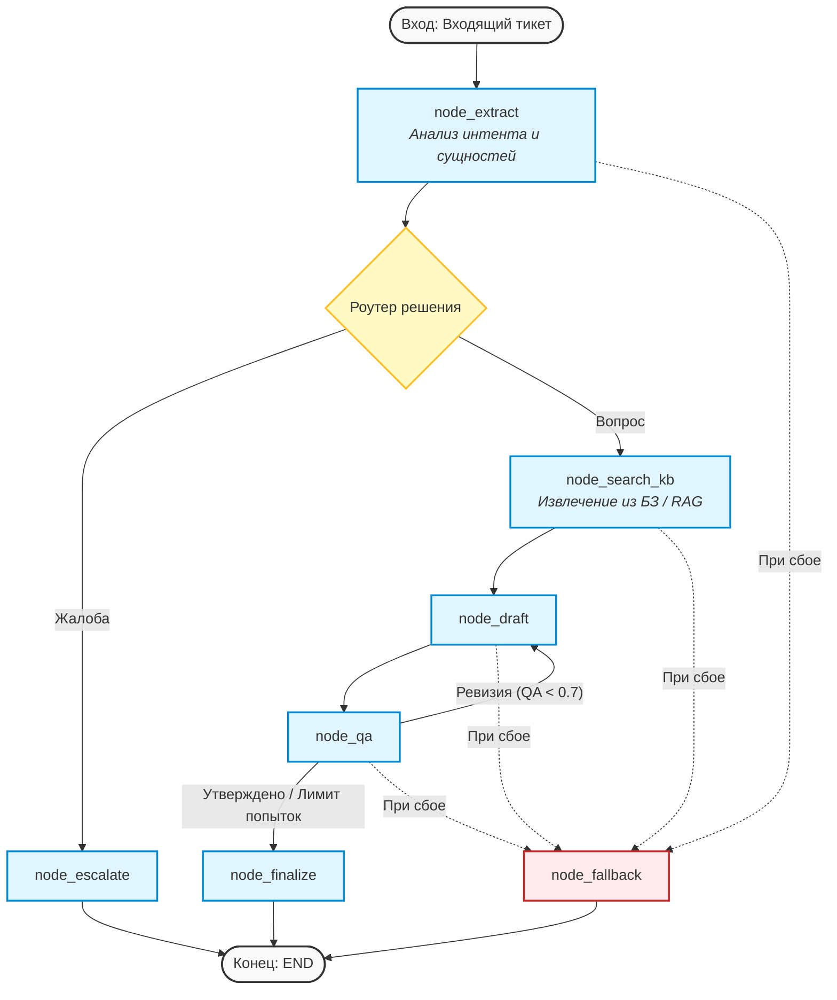

# Multi-Agent Support System (MAS) on LangGraph

Асинхронная мультиагентная система (MAS) поддержки клиентов, построенная на базе **LangGraph**, **FastAPI** и **Pydantic v2**. Система автоматически классифицирует входящие обращения, извлекает сущности, работает с базой знаний по паттерну RAG, а также включает изолированный контур контроля качества (LLM-as-a-Judge) с механизмом саморефлексии (Self-Reflection) и итеративной доработки ответов.

Проект разработан с учетом строгой статической типизации (`mypy --strict = true`) и сквозного контекстного логирования.

---

## Архитектура системы

Система представляет собой направленный граф состояний (State Graph), где каждый узел — это изолированная асинхронная агент-функция, взаимодействующая с другими узлами исключительно через единую шину состояния `SupportState`.



### Основные компоненты:
1. **Core Слой (`app/core/`)**: Настройки (`pydantic-settings`), кастомные исключения, сквозной `TicketLoggerAdapter` для контекстного логирования и строго типизированные декораторы для мониторинга (замер latency вызовов LLM).
2. **Слой Сервисов (`app/services/`)**: Изолированные функции взаимодействия со сторонними API и LLM-провайдерами(Заглушки).
3. **Слой Агентов (`app/agents/`)**: Независимые воркеры-узлы графа. Вся рутина (обработка исключений, логирование) вынесена в декораторы.
4. **Слой Оркестрации (`app/graph/`)**: Декларативное описание графа LangGraph и чистые функции-роутеры для ветвления логики.


## 🛠 Технологический стек

* **Python 3.12+**
* **LangGraph** (оркестрация и управление стейтом агентов)
* **Pydantic v2 / pydantic-settings** (валидация данных и конфигурации)
* **Asyncio** (асинхронный рантайм)
* **Mypy** (строгий статический анализ типов)
* **Ruff / Pre-commit** (линтинг и форматирование кода)

---

## Быстрый запуск

### 1. Клонирование репозитория и настройка окружения

Клонируйте репозиторий к себе:

```bash
git clone https://github.com/ArtemZinukov/langgraph_agents
```

Установите зависимости:

```bash
pip install -r requirements.txt
```

Настройте файл .env в корне проекта:

 * QA_THRESHOLD=0.7              - Порог прохождения контроля качества ответа (QA-Judge)
 * MAX_REVISION_ITERATIONS=2     - Максимальное количество итераций ревизии (доработки) ответа
 * LOG_LEVEL=INFO                - Уровень логирования системы


### 2. Запуск проекта

```bash
python main.py
```

## Для разработчиков

В проекте настроены pre-commit хуки, а также строгая проверка типов. Перед коммитом код автоматически проверяется линтерами.

Установите инструменты разработки:

```bash
pip install ruff mypy pre-commit
```

Инициализируйте хуки git:
```bash
pre-commit install
```

## Ожидаемый вывод в консоли (Пример работы)

При запуске python main.py система последовательно обрабатывает очередь входящих тикетов, динамически обогащая логи контекстом Ticket: [ID] и замеряя время выполнения (latency) каждого вызова LLM.

Вывод в консоли будет выглядеть следующим образом:

```Plaintext
2026-05-16 20:47:08,090 - [INFO] - Ticket: N/A - Запуск Мультиагентной Системы Технической Поддержки...
2026-05-16 20:47:08,090 - [INFO] - Ticket: T-BA46A9 - --- НАЧАЛО ОБРАБОТКИ ТИКЕТА ---
2026-05-16 20:47:08,096 - [INFO] - Ticket: T-BA46A9 - Анализ входящего обращения: 'Как мне сбросить пароль в личном кабинете?'
2026-05-16 20:47:08,209 - [INFO] - Ticket: T-BA46A9 - Intent Extraction успешно завершена за 0.1131s.
2026-05-16 20:47:08,209 - [INFO] - Ticket: T-BA46A9 - Успешно извлечено намерение: question
2026-05-16 20:47:08,212 - [INFO] - Ticket: T-BA46A9 - Запрос к базе знаний по извлеченным сущностям...
2026-05-16 20:47:08,316 - [INFO] - Ticket: T-BA46A9 - Найдено релевантных документов: 2
2026-05-16 20:47:08,317 - [INFO] - Ticket: T-BA46A9 - Запуск генерации черновика ответа (Итерация ревизии: 0)
2026-05-16 20:47:08,427 - [INFO] - Ticket: T-BA46A9 - Generation успешно завершена за 0.1100s.
2026-05-16 20:47:08,428 - [INFO] - Ticket: T-BA46A9 - Валидация черновика в узле контроля качества (QA)...

[Ticket: T-BA46A9]
Пользователь: Как мне сбросить пароль в личном кабинете?
Ответ системы: Согласно базе знаний компании, Статья №103: Для сброса пароля перейдите в личный кабинет и нажмите 'Забыли пароль'.
--------------------------------------------------
2026-05-16 20:47:08,535 - [INFO] - Ticket: T-BA46A9 - QA-Judge успешно завершена за 0.1062s.
2026-05-16 20:47:08,535 - [INFO] - Ticket: T-BA46A9 - Результат QA проверки -> Оценка: 0.9
2026-05-16 20:47:08,536 - [INFO] - Ticket: T-BA46A9 - Ответ успешно утвержден QA и готов к отправке.
2026-05-16 20:47:08,536 - [INFO] - Ticket: T-BA46A9 - Обработка завершена. Статус эскалации: False
```
